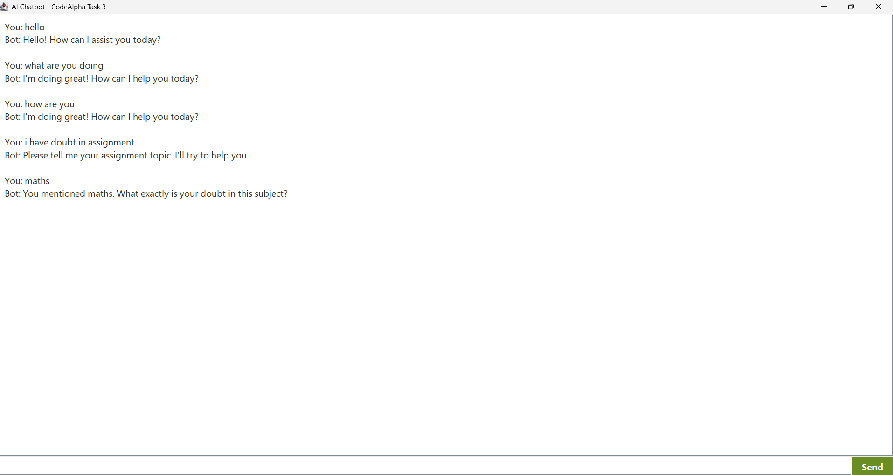

# 🤖 AI Chatbot – CodeAlpha Internship Task 3

A Java-based Artificial Intelligence Chatbot built using Swing for GUI and rule-based Natural Language Processing (NLP) for intent detection and conversational response handling.

---

## 📌 Project Overview

This project implements an interactive AI chatbot that can:

- Understand user input using basic NLP techniques
- Detect user intent using rule-based classification
- Respond to frequently asked questions (FAQs)
- Handle simple contextual conversations
- Provide a graphical interface for real-time interaction

The chatbot demonstrates core AI concepts such as tokenization, intent mapping, and response generation using Object-Oriented Programming principles.

---

## ✨ Features

- 🖥 GUI-based interactive chatbot (Java Swing)
- 🧠 Rule-based intent detection
- 🔎 Basic NLP (tokenization of user input)
- 💬 Context-aware follow-up handling
- 📚 FAQ response system
- 🏗 Clean OOP-based architecture

---

## 🛠 Technologies Used

- Java
- Java Swing (GUI)
- OOP (Object-Oriented Programming)
- HashMap for intent mapping
- Basic NLP logic

---

## 📂 Project Structure
CodeAlpha_AIChatbot/
│
├── ChatbotUI.java
├── ChatbotEngine.java
├── IntentClassifier.java
├── FAQRepository.java
└── README.md
## 📸 Application Screenshot

## 🚀 How to Run

1. Open the project in any Java IDE (Eclipse / IntelliJ / VS Code).
2. Compile the files.
3. Run `GradeTrackerUI.java`.
4. Enter student details and subject-wise marks.
5. Click **Show Summary** to view:
   - Average marks  
   - Highest scoring subject  
   - Lowest scoring subject  

---

## 📚 Project Type

**CodeAlpha Internship – Task 1**  
Student Grade Tracker

---

## 👩‍💻 Author

**Shaik Saniya**  
Java Developer 
